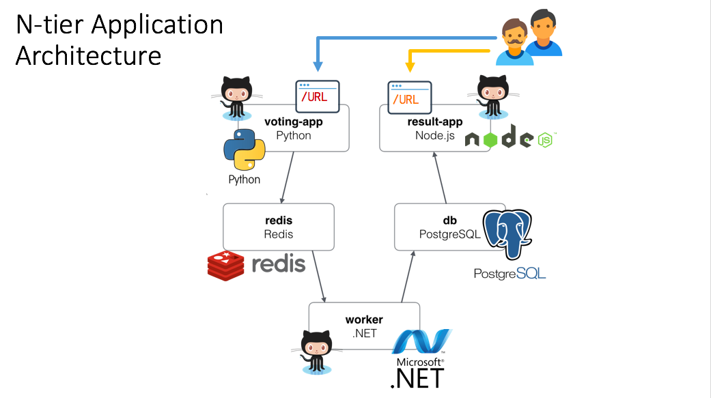
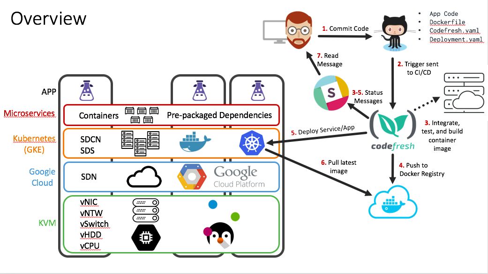

Example N-Tier Voting App with [Codefresh](https://codefresh.io/kubernetes-deploy/) and [Kubernetes (GKE)](https://cloud.google.com/container-engine/) on [Google Cloud](https://cloud.google.com/why-google/)
=========

Create an account in the following services: 

### 1. [Github](https://github.com/)
  - [Fork](https://help.github.com/articles/fork-a-repo/) the following repositories into your account 
    - [Vote](https://github.com/MayankTahil/vote)
    - [Results](https://github.com/MayankTahil/result)
    - [Worker](https://github.com/MayankTahil/worker)

### 2. [Slack](https://slack.com/create)
  - Create an account and then logon to slack's native app to receive notifications

### 3. [CodeFresh](https://g.codefresh.io/signup)
  - You can use your Github account to log on if you like
  - Configure Github, Slack, Docker Hub, and GKE integrations by following steps within the **Integration** tab within your account settings in [Codefresh.io](https://g.codefresh.io/account/integration). Click the link to be directed to the page. Refer to [this video](https://www.youtube.com/watch?v=H0qDASqgg8k) to get you started.

### 4. [Dockerhub](https://hub.docker.com/)
  - Create a new account to store your docker images

### 5. [Google Cloud](https://cloud.google.com/why-google/)
  - Here is a [quick start guide](./GKE-setup/README.md) to setting up your Kubernetes cluster in GKE.

Application Overview
-----

* A [Python webapp](https://github.com/MayankTahil/vote) which lets you vote between two options
* A Redis queue which collects new votes
* A [.NET worker](https://github.com/MayankTahil/worker) which consumes votes and stores them in…
* A Postgres database backed by a Docker volume
* A [Node.js webapp](https://github.com/MayankTahil/result) which shows the results of the voting in real time

Operations Overview
-----

In this repository folder **GKE-setup** there are sub folders for each microservice holding the `deployment.yaml`, `service.yaml`, and `codefresh.yaml` (for the managed repositories). The combination of all three will define your pipeline in Codefresh and provide deployment instructions on how to deploy your services in GKE.

Instructions
----

1. Using gcloud/kubectle issue a [persistent volume claim](https://kubernetes.io/docs/concepts/storage/persistent-volumes/#persistentvolumeclaims) manually via the [Cloud Shell](https://cloud.google.com/shell/docs/quickstart). Enter the following command:

`kubectl create -f db-data-persistentvolumeclaim.yaml`
  > [db-data-persistentvolumeclaim.yaml](./db/persistentvolumeclaim.yaml) are the contents of the file for reference.
  Note adding of [persistent volume claim](https://kubernetes.io/docs/concepts/storage/persistent-volumes/#persistentvolumeclaims) is not supported in CodeFresh UI at the time of writing, hence the manual kubectl command above needs to be issued as a pre-requisite.

2. In CodeFresh once you have integrated your GKE cluster, you can navigate to the Kubernetes tab in Codefresh to deploy your back-end PostGreSQL DB and Redis services. Use the `deployment.yaml` and `service.yaml` files in the respective directories. When adding a new service, flip the `yaml` switch near the top and copy and paste the contents within the following files for : 
  - PostGreSQL
    - [deployment.yaml](./db/deployment.yaml)
    - [service.yaml](./db/service.yaml)
  - Redis
    - [deployment.yaml](./redis/deployment.yaml)
    - [service.yaml](./redis/service.yaml)

3. In Codefresh, [add the three repositories](https://g.codefresh.io/repositories?filter=view:all;mode:grid) from your Github account. The icon to *add repositories* is on the top right. The `codefresh.yaml` files in each directory should automatically set up the pipeline within the repository for you. **For your deployment, you will need to update:**
  * Which Kubernetes Cluster the pipeline deploys to (defined in the respective `codefresh.yaml` file)
  * Which Docker Hub account/ registry  name to push (also defined in the respective `codefresh.yaml` file)

4. Hit Build to deploy your workflow in CodeFresh.

Note
----

The voting application only accepts one vote per client. It does not register votes if a vote has already been submitted from a client.